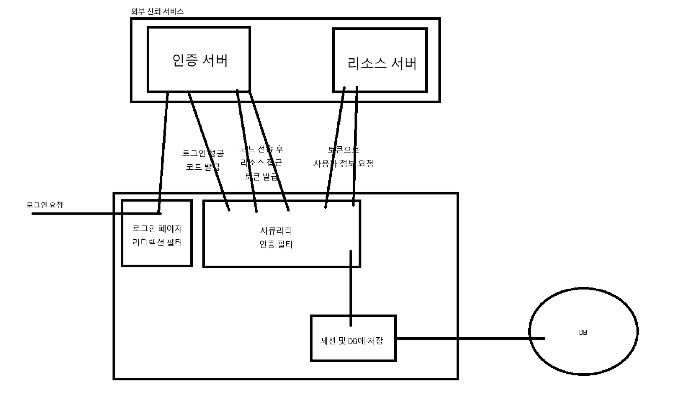

# Spring-OAuth2
🏃Spring OAuth2 Project

### 1. Introduction
**개발자 유미**님의 강의를 참고하여 OAuth2를 구현한 프로젝트입니다.
이 프로젝트는 Spring Boot와 Spring Security를 사용하여 OAuth2 인증을 구현하고, JWT를 통해 토큰 기반 인증을 처리합니다. MySQL 데이타베이스를 사용하여
사용자 정보를 저장하고 관리합니다. 이 프로젝트는 OAuth2 인증의 기본적인 흐름을 이해합니다. 
### 2. Tech Stack

### 3. Version & Implementation
- **Spring Boot**: 3.5.0 
- **Spring Security**: 6.2.1
- **OAuth2 Client**
- **Lombok**
- **Spring Data JPA - MySQL**
- **Gradle - Groovy**
- **IntelliJ IDEA**

---

- **인증**: Naver, Google 소셜로그인
- **인가**: 세션 방식을 통한 경로별 접근 권한
- **인증 정보**: DB 저장 후 추가 정보 기입

### 4. Oauth2.0 Structure

### 5. ETC
- Oauth2.0 코드 방식 인증 활용
- SSR 방식으로 페이지 응답

